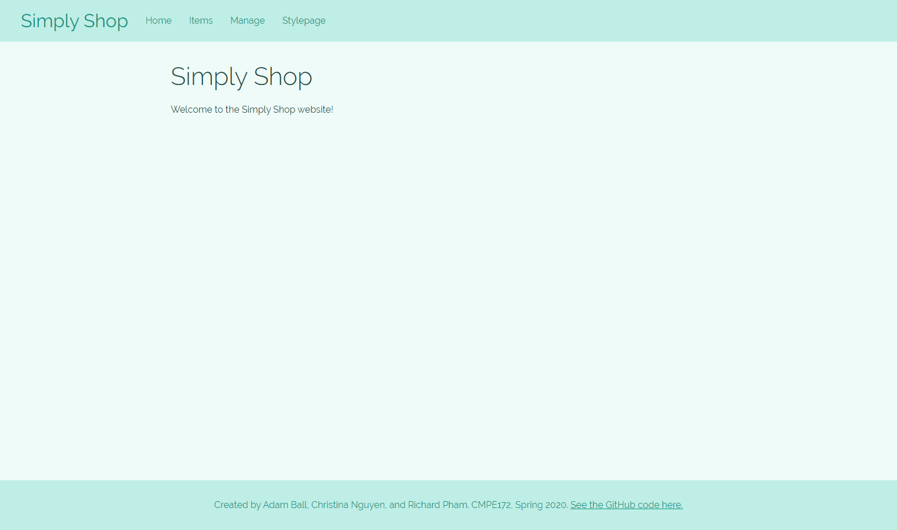
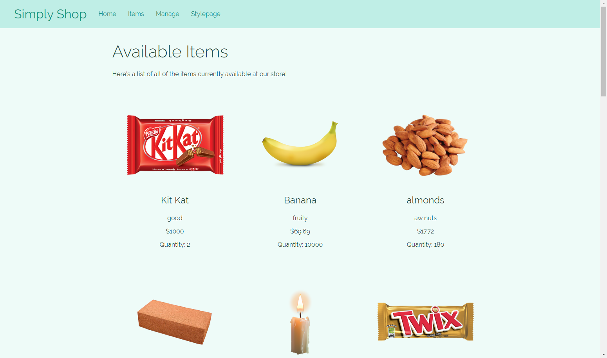
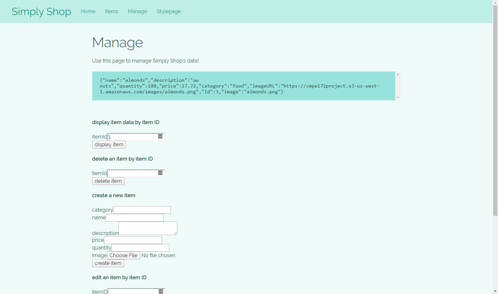
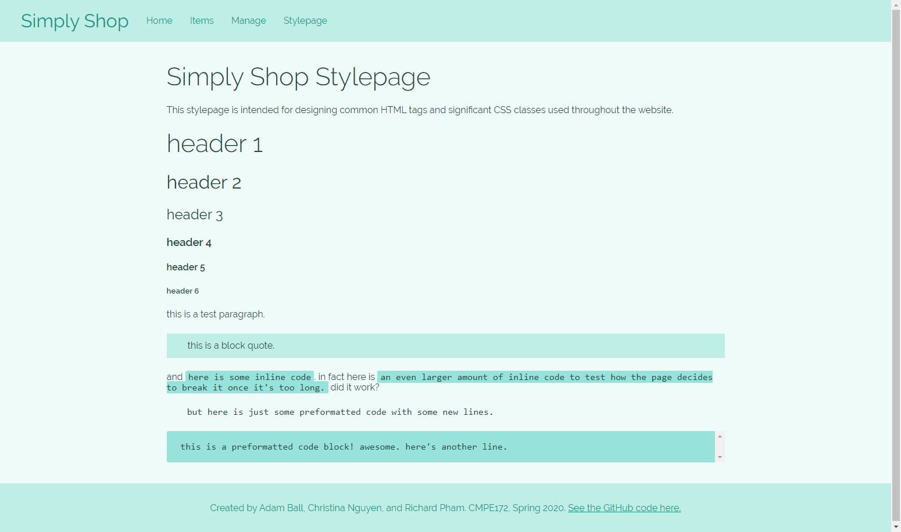

# Simply Shop

San Jose State University

Project submitted for Babu Thomas's Enterprise Software - CMPE172 Spring 2020 class.

Created by Richard Pham, Adam Ball, and Christina Nguyen.

### Table of Contents

- [Project Introduction](https://github.com/richardphamsjsu2016/172project#project-introduction)
- [Links to Application](https://github.com/richardphamsjsu2016/172project#links-to-application)
- [Screenshots](https://github.com/richardphamsjsu2016/172project#screenshots)
- [Prerequisites for Set-up](https://github.com/richardphamsjsu2016/172project#prerequisites-for-set-up)
- [How to Run the Project](https://github.com/richardphamsjsu2016/172project#how-to-run-the-project)
- [Database Schema and Example Queries](https://github.com/richardphamsjsu2016/172project#database-schema-and-example-queries)
- [Spring Boot API Endpoints](https://github.com/richardphamsjsu2016/172project#spring-boot-api-endpoints)
- [Frontend to Backend Data Transport](https://github.com/richardphamsjsu2016/172project#frontend-to-backend-data-transport)
- [Docker Instructions](https://github.com/richardphamsjsu2016/172project#docker-instructions)

### Project Introduction

The Simply Shop application allows users to window shop for items that are in stock at a store so that they can plan ahead before going in person to purchase items. A home page can be customized to fit the visual and functional requirements of a store’s items. Item listings online are stored in a database through Amazon Web Services and can be instantly added, removed, or updated through the web interface as price or quantity changes. Simply Shop is an efficient, effective, and customizable solution for stores that need the ability to quickly inform their customers of their available stock.

Future updates will include a login option for the user as well as a cart system.

### Links to Application

[Main application, including frontend](http://52.87.248.183:3000/)

[Springboot backend](http://ec2-54-164-61-67.compute-1.amazonaws.com:8080/)

### Screenshots

### Prerequisites for Set-up

In order to download and run the source code yourself, you’ll need a recent version Apache Maven installed on your system. This is to run the Spring Boot backend. You can download Maven for:

- Windows: https://howtodoinjava.com/maven/how-to-install-maven-on-windows/
- Mac OSX: http://maven.apache.org/install.html

You’ll also need the most recent version of Node. This is to run the React frontend. This can be downloaded at https://nodejs.org/en/download/ for Windows, Mac, or Linux platforms.

### How to Run the Project

To run the Spring Boot application:

1. Open a command prompt/terminal within the “172Project” folder that contains the “pom.xml” file.
2. Type in “mvn spring-boot:run” inside the command prompt/terminal
3. Type in http://localhost:${port#}/

To run the React frontend application:

1. Open a command prompt/terminal within the folder called “react-frontend.”
2. Run the command “npm install” which will take some time to install all of the proper dependencies for the project according to the contents of the package.json file.
3. Before moving onto the next step, make sure that the Spring Boot application is running without any errors.
4. Run the command “npm start” which will begin the React application and automatically open a window in your browser.
5. That’s it! Now you can use all of the webpage features of Simply Shop that interface through the Spring Boot backend.

### Database Schema

### Spring Boot API Endpoints

##### @GetMapping(value = "/api/items")

*GET method that returns a JSON array listing every item*

##### @GetMapping(value = "/api/items/{itemID}")

*GET method that returns a JSON object representing a single item matching a given item ID within the RDS database*

##### @PostMapping(value = "/api/items")

*POST method that takes a FormData object to create an item object and push it into the RDS database*

##### @RequestMapping(value = "/api/edit/{itemID}”)

*REQUEST method that takes a FormData object to edit an item matching a given item ID within the RDS database*

##### @DeleteMapping(value = "/api/items/{itemID}")

*DELETE method to delete an item based on the item ID within the RDS database; will delete both RDS and S3 instances related to the object*

### Frontend to Backend Data Transport

The React frontend communicates with the Spring Boot backend using a basic set of tools that come packaged with the Create React App available through Node.js. A proxy is configured for API calls and the fetch routine is used to POST and GET data to and from endpoints exposed by Spring Boot while a REQUEST method will both POST and GET data. These fetch commands receive Promise objects that contain the response from the backend. React expects this response to be in a JSON format, which is quickly converted to a JavaScript object that can be properly iterated over, displayed, and modified as necessary. This makes it possible for us to assume nothing about the backend other than expecting a JSON object at a specific URL address, greatly decoupling the relationship between React and Spring Boot.

Because Simply Shop’s web page templates are set up statically, a strategy is necessary for incoming asynchronous data to be updated on the frontend. React’s built-in Effect and State systems allows us to send these fetch requests the moment a page is loaded and to later modify HTML data on the visitor’s page the moment that Spring Boot returns a response.

When sending data back to the backend to modify data through a POST request, Spring Boot expects data in a slightly different format. The best approach is for us to send a FormData object back through the fetch() command with the “method” set to POST. The FormData objects include keys and values representative of every field which the user was able to edit and allows us to go straight from the inputs in the HTML to sending to Spring Boot with little to no transformation of the input data. However, Spring Boot expects these form fields to be named according to the variable structure specified in Java, requiring some knowledge of the API implementation in order to properly send data into the endpoint. Otherwise, it will throw an error stating that values required for the functions in Spring Boot are missing. 

In Spring Boot, the values required for the method will be set as a RequestParam, which requests for the values from the frontend. If the requirement is set to true and the value is not available from the frontend, the function will end and return an error back to the frontend to notify that values are missing. Otherwise, the function will continue and a HTTP OK status will return. 

Within Spring Boot, the application creates a connection to AWS with pre-set credentials. To create, delete, or update an item, it would create a connection with AWS RDS and send query requests to it. If accepted, the query will go through and update the corresponding RDS table and send back the Item object as a JSON object for the Frontend to pull data from. Otherwise, the function returns either null or false and the React frontend will respond correspondingly. S3 images are also either updated, created, or deleted and the S3 database updates to match.

### Docker Instructions

The Spring Boot app can be dockerized, and it was dockerized before deploying it on AWS EC2. The dockerized file has not been provided here; only the .jar file is. To manually dockerize the app:
1) Load the project into Eclipse IDE for Java EE Developers 2020-03.
2) Inside the project folder, create a file called “Dockerfile”. Make sure to keep the capital “D”. 
3) Fill in the Dockerfile with the following information:

FROM java:8

EXPOSE 5000

ADD target/simplyshop.jar simplyshop.jar

ENTRYPOINT ["java","-jar","/simplyshop.jar"]

4) Generate jar by right clicking the entire project and clicking Run as “Maven Install."
5) Run docker.
6) Go to the file location of the project.
7) Type docker build -t simplyshop.jar .
8) Type docker image ls
9) Type docker run -p 9090:5000 simplyshop.jar
10) On your browser, go to localhost:9090/api/items to see the list of items.

If you are deploying to EC2, use this text for Dockerfile instead:

FROM java:8

WORKDIR /

ADD simplyshop.jar simplyshop.jar

COPY application.properties application.properties

EXPOSE 5000

CMD java -jar simplyshop.jar -Dspring.config.location=application.properties